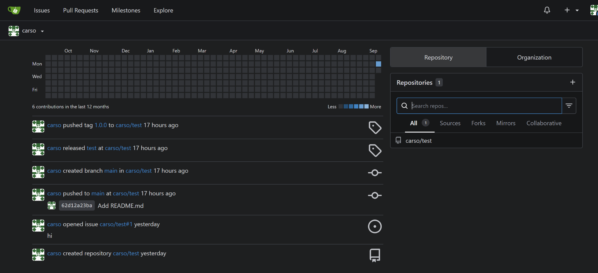
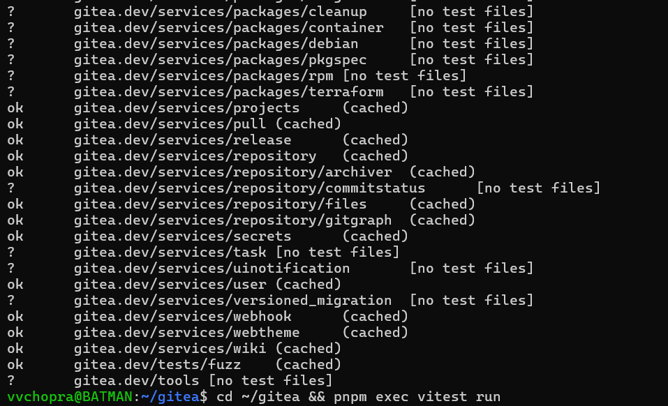
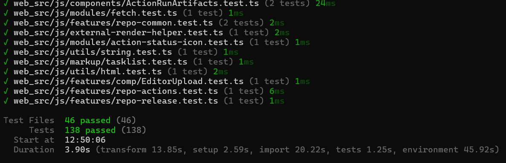

# Report: Sprint 0

**Team Name:** GiCoffee

**Team member names:** Vishav Chopra (vvchopra), Carson Rackley (CarsonRackley), Arjun Bhat
(arjunsb26), Aman Bhoot (ab-wm), Jack Donohue (Jack-Donohue), Ethan Turner (controlled-opposition)

**Project Name:** Gitea

**Project Link:** <https://github.com/CSCI-435-SE/gitea>

## Project Overview

### Setup Evidence

#### App running locally

#### Test suites passing

The full output of each run is committed next to this report, so the results can be checked line by line
rather than read off a screenshot:

| Run | Command | Output file | Result |
| --- | --- | --- | --- |
| Backend unit tests | `make test-backend` (`go test -timeout 40m -tags ''`) | [test-output/test-backend.md](test-output/test-backend.md) | All packages `ok`, no failures |
| Integration tests (SQLite) | `make test-sqlite` | [test-output/test-integration.md](test-output/test-integration.md) | `PASS` |
| Frontend unit tests | `pnpm exec vitest run` | [test-output/vitest.md](test-output/vitest.md) | 46 test files, 138 tests passed |

Backend unit tests:

The integration run has no screenshot; its full output is in
[test-output/test-integration.md](test-output/test-integration.md), which ends in `PASS`.

Front end test suite passing:

In order for all tests to pass, the tests were run in WSL (Debian) rather than native Windows, as
`STUDENTS.md` recommends, because native Windows runs produce platform-only failures (specifically
symlinks and temporary files).

### What does the system do? Who are its users? What are its main features?

The core purpose of the project is to provide "the easiest, fastest, and most painless way of setting up
a self-hosted Git service," in their own words. Thus, the users are software development teams that
would prefer to self-host their own "GitHub," so to speak, instead of relying on a third party for that
software. That is also where the features lie, where Gitea aims to be a fully featured and self-hosted
git service with modern development tools like CI/CD (essentially GitHub Actions).

Main features:

- Git hosting over HTTP and SSH, with a web code browser, blame, diffs, and releases
- Issues, pull requests, code review, labels, milestones, and project (Kanban) boards
- Wikis, package registries, and Gitea Actions (CI compatible with GitHub Actions workflows)
- Users, organizations, and teams with fine-grained permissions; 2FA, WebAuthn passkeys, OAuth2 and OpenID

### What are the main components and how do they interact?

The front end and the backend have their own set of concerns and architecture decisions.

#### Front End

The pages are rendered with Go HTML templates with the help of Vue3 and Fomantic-UI (although it is
slowly being removed for accessibility reasons). The relevant directories for that purpose are:

- `css` for css files
- `js` for the Javascript and Typescript code
- `Components` for Vue components
- `Features` for all the various implemented functionality
- `template` for all the Go templates

An important note here is that Vue is used without JSX to separate html from code.

#### Backend

The backend has a far larger collection of directories with various important functionality. The most
significant ones are:

- `cmd` for subcommands (such as web, actions that need to be done impact systems as a whole)
- `Models` that contain data structures and other similar functionality to communicate between
  components, such as between the DB and the code via XORM, with minimal dependencies
- `Modules` for self-contained functionality
- `Routers` that, as the name suggests, contains code that handles the management of requests between
  components
- `Services` that connect the routers and models together
- `Templates` for go templates

It should be noted that they have a strict dependency direction: `cmd → routers → services → models →
modules`. The API of Gitea, to the extent possible, follows the API of GitHub.

**How they interact:** When a user opens a page, `cmd web` has already started the server. The request
goes through a route in `routers/web`, where middleware sets up the session and the signed-in user. The
handler calls `services/` for business logic. Services use `models/` to read and write the database and
`modules/git` to work with repositories. The handler then renders a Go template, and the browser loads
the compiled JavaScript and CSS from `web_src/`. Some features send requests back to web routes in the
background. API clients go through `routers/api/v1` instead and get JSON back from the same services and
models. The API uses the same endpoints and fields as GitHub's REST API where possible.

(Based on `docs/guidelines-frontend.md` and `docs/guidelines-backend.md`)

### What are the major technologies, frameworks, and external services?

#### Backend technologies

Written in Go 1.26.4, supported by XORM ORM (Object-relational mapping between a DB and an OOP language)
and Chi for the webserver wrapping it providing REST API.

#### Frontend technologies

The frontend with Vue as the main front end tech, supported by jQuery and bundled with Vite, and pnpm
11.9.0 as the package manager.

#### Git

Of course, Git.

#### Database

The database could be either of the four: mysql, PGSQL, sqlite3, or mssql with their appropriate
go-compatible drivers.

#### Testing and CI

Go `testing` with testify, Vitest, Playwright end-to-end tests.

### How is the code organized (directory structure, key packages/modules)?

The main repo has been split into folders with distinct purposes. For example, there are separate
folders for assets, docker, tests etc. However, an extremely important folder here is services, which
contain folders of all the various features of the application. This is the place to look if there is a
need to change a feature or function of the application.

Another important folder is the template folder that appears to contain all the various HTML files used
for the UI of the application, and other purposes like mail. So, this will be important for UI changes.

The modules folder also seems to be important, as it contains folders for dependencies (like git, glob,
and hcaptcha) and other self-contained functionality.

| Path | Contents |
| --- | --- |
| `cmd/` | CLI entry points (`gitea web`, `gitea admin`, …) |
| `routers/` | HTTP layer: `web/`, `api/`, `install/`, `private/`, `common/` |
| `services/` | Business logic, about 40 packages |
| `models/` | Database models and schema migrations (`models/migrations`) |
| `modules/` | Shared low-level packages, about 85 (`git`, `setting`, `markup`, `web`, …) |
| `templates/` | Server-rendered HTML templates |
| `web_src/` | Frontend TypeScript, Vue, and CSS source |
| `options/locale/` | UI strings; `locale_en-US.json` is the source, other languages come from Crowdin |
| `tests/` | Integration and end-to-end tests; unit tests live next to the code as `*_test.go` |
| `docs/`, `ai-logs/` | Course folders for sprint documents and AI logs |

### How do developers typically contribute? What is the PR and code review workflow? What are the standards for issue reporting, triage, and management?

Their contribution guidelines clearly state the steps to be taken for every specific issue.

- **Issues:** The general steps are to file an issue with the appropriate tags, although larger changes
  must pass a change proposal process before being accepted. Contributors search for duplicates first,
  and security problems are reported privately. Maintainers triage with type, scope, and priority labels.
- **Pull Requests:** PRs target `main` and use a Conventional Commits title such as `feat(api): …` or
  `fix(web): …`. They should be small and focused. Feature PRs must describe usage and testing, UI
  changes need screenshots, closed issues are listed as `Closes #N` on separate lines. Before submitting
  a pull request, run the appropriate linters and tests.
- **Review:** upstream requires two maintainer approvals before a PR enters the merge queue, and PRs are
  squash-merged. Authors must not rebase or force-push once review starts. Reviewers check that the
  description matches the change, give actionable feedback that separates required changes from
  suggestions, and do not rubber-stamp approvals.
- Everything has its own style of guides and formats and must be followed. That includes pull requests,
  PRs and documentation.
- The steps and standards of issue reporting and other aspects of code management have been clearly
  defined within the documentation, with every single step detailed, including language, tagging,
  proof/screenshots, correctly marking breaking PRs, responsibilities of the person requesting the PR,
  and general best practices.

## Feature Backlog

There were a total of 25 issues opened this sprint by the team, plus the 2 issues provided by the
instructor. The issues were from across the entire program, mostly targeting the visible elements of the
application with small bugs, QOL changes and desired features to further match the design of Github.
Among the issues, the most important ones are:

| Issue Title | Issue Link | Description |
| --- | --- | --- |
| Let users choose a reason when closing an issue or pull request | [#12](https://github.com/CSCI-435-SE/gitea/issues/12) | Closing an issue records no reason, so "fixed", "duplicate" and "not planned" all look identical afterwards. Recording a reason makes issue history readable and matches what other forges already offer. |
| Block pull request merges until prerequisite pull requests are merged | [#20](https://github.com/CSCI-435-SE/gitea/issues/20) | Lets a PR declare that it depends on another one and blocks the merge until the prerequisite lands. We hit this problem ourselves in Sprint 0, when PRs #8, #9 and #15 had to be merged in a specific order. |
| Calendar view and iCalendar subscription feed | [#36](https://github.com/CSCI-435-SE/gitea/issues/36) | Due dates and milestones can only be read one page at a time. A calendar view, plus an iCalendar feed that users can subscribe to from their own calendar app, makes deadlines visible where people already look for them. |
| Overhauled notifications system | [#7](https://github.com/CSCI-435-SE/gitea/issues/7) | Notifications are one of the features every user touches daily, and the current implementation offers little filtering or grouping. A larger improvement here benefits every part of the application. |
| Expand/Implement functionality for keyboard navigation/shortcuts | [#23](https://github.com/CSCI-435-SE/gitea/issues/23) | Keyboard shortcuts for the common pages make the application faster for power users and improve accessibility, an area the upstream project acknowledges is still incomplete. |

The full backlog, by author:

| Member | Issues opened |
| --- | --- |
| Aman Bhoot (ab-wm) | [#3](https://github.com/CSCI-435-SE/gitea/issues/3), [#4](https://github.com/CSCI-435-SE/gitea/issues/4), [#5](https://github.com/CSCI-435-SE/gitea/issues/5), [#6](https://github.com/CSCI-435-SE/gitea/issues/6), [#7](https://github.com/CSCI-435-SE/gitea/issues/7) |
| Carson Rackley (CarsonRackley) | [#11](https://github.com/CSCI-435-SE/gitea/issues/11), [#12](https://github.com/CSCI-435-SE/gitea/issues/12), [#13](https://github.com/CSCI-435-SE/gitea/issues/13), [#14](https://github.com/CSCI-435-SE/gitea/issues/14) |
| Ethan Turner (controlled-opposition) | [#17](https://github.com/CSCI-435-SE/gitea/issues/17), [#18](https://github.com/CSCI-435-SE/gitea/issues/18), [#19](https://github.com/CSCI-435-SE/gitea/issues/19), [#20](https://github.com/CSCI-435-SE/gitea/issues/20) |
| Jack Donohue (Jack-Donohue) | [#21](https://github.com/CSCI-435-SE/gitea/issues/21), [#22](https://github.com/CSCI-435-SE/gitea/issues/22), [#23](https://github.com/CSCI-435-SE/gitea/issues/23), [#25](https://github.com/CSCI-435-SE/gitea/issues/25) |
| Vishav Chopra (vvchopra) | [#26](https://github.com/CSCI-435-SE/gitea/issues/26), [#27](https://github.com/CSCI-435-SE/gitea/issues/27), [#28](https://github.com/CSCI-435-SE/gitea/issues/28), [#29](https://github.com/CSCI-435-SE/gitea/issues/29) |
| Arjun Bhat (arjunsb26) | [#34](https://github.com/CSCI-435-SE/gitea/issues/34), [#35](https://github.com/CSCI-435-SE/gitea/issues/35), [#36](https://github.com/CSCI-435-SE/gitea/issues/36), [#37](https://github.com/CSCI-435-SE/gitea/issues/37) |
| Instructor (musta55) | [#1](https://github.com/CSCI-435-SE/gitea/issues/1), [#2](https://github.com/CSCI-435-SE/gitea/issues/2) |

## Standards Document

The team is to follow the guidelines as laid out by the upstream Gitea team, as the documents are highly
detailed, touching upon every single part of the repository. Hence, we did not find it necessary to
deviate from the project's existing guidelines. The only changes we did were to add on top of the
existing rules.

Among the changes, most of the information reaffirms the project's current rules to make it clear what
needs to be done for each part of the project. There is some additional information on Branching and
Commit Conventions to ensure that PRs remain small and branching remains clean (naming convention and
other finer details follows `STUDENTS.md`). The process of pull requests and tests follows the same
pattern as enforced by git and documentation provided in `STUDENTS.md`; all PRs must be reviewed by a
team member and functionality tested before being approved, and make tests for all changes, when
possible.

The Standards Document is available as a markdown file within the same folder as this report:
[standards.md](standards.md).

## Completed PRs

| PR Title | Issue Link | Author | Reviewer(s) | Status | Description |
| --- | --- | --- | --- | --- | --- |
| [#8 chore(claude-related-init): students docs and gitignore for specstory](https://github.com/CSCI-435-SE/gitea/pull/8) | — | ab-wm | CarsonRackley, vvchopra | Merged | Adds the `.claude-students` context documentation set for developers and AI agents, and ignores `.specstory` |
| [#9 enhance(ui): add remaining characters counter on issue title fields](https://github.com/CSCI-435-SE/gitea/pull/9) | [#2](https://github.com/CSCI-435-SE/gitea/issues/2) | ab-wm | CarsonRackley | Merged | Live "characters left" counter on issue title fields, with color feedback near the limit |
| [#10 feat(web): serve a default robots.txt instead of 404](https://github.com/CSCI-435-SE/gitea/pull/10) | [#5](https://github.com/CSCI-435-SE/gitea/issues/5) | ab-wm | CarsonRackley | Merged | Serves a built-in default `robots.txt` when the admin has not supplied one |
| [#15 chore(docs): ran lint fix on students.md](https://github.com/CSCI-435-SE/gitea/pull/15) | — | ab-wm | CarsonRackley | Merged | Fixes markdown lint errors in `STUDENTS.md` that were failing CI on every PR |
| [#16 enhance(repo): releases page is blank when a repository has no releases](https://github.com/CSCI-435-SE/gitea/pull/16) | [#1](https://github.com/CSCI-435-SE/gitea/issues/1) | CarsonRackley | ab-wm | Merged | Empty-state message on the Releases page, with a New Release button for users who can create one |
| [#24 feat(user): registered passkeys cannot be renamed](https://github.com/CSCI-435-SE/gitea/pull/24) | [#17](https://github.com/CSCI-435-SE/gitea/issues/17) | CarsonRackley | vvchopra | Merged | Rename action for registered security keys, with validation, duplicate and ownership checks |
| [#30 chore(agents): require human approval before AI commits](https://github.com/CSCI-435-SE/gitea/pull/30) | — | CarsonRackley | ab-wm | Merged | Adds the team's AI commit-approval rule to `AGENTS.md` |
| [#31 feat(web): Display warning color on Issues and Milestones within 72 hours of deadline](https://github.com/CSCI-435-SE/gitea/pull/31) | [#3](https://github.com/CSCI-435-SE/gitea/issues/3) | Jack-Donohue | ab-wm | Merged | Warning color for due dates within 72 hours, shared by issues and milestones |
| [#32 feat(ui): show issue and PR hover previews on all issue links](https://github.com/CSCI-435-SE/gitea/pull/32) | [#22](https://github.com/CSCI-435-SE/gitea/issues/22) | vvchopra | CarsonRackley | Merged | Hover previews for issue and pull request references |
| [#33 chore(ai-log): add missing ai logs for ab-wm](https://github.com/CSCI-435-SE/gitea/pull/33) | — | ab-wm | Jack-Donohue | Merged | Adds missing AI session logs |
| [#38 feat(web): Add stale branch indicator](https://github.com/CSCI-435-SE/gitea/pull/38) | [#11](https://github.com/CSCI-435-SE/gitea/issues/11) | Jack-Donohue | ab-wm | Merged | Marks branches with no recent commits as stale in the branch list |
| [#39 feat(ui): add Nord, Solarized, Gruvbox and Catppuccin color themes](https://github.com/CSCI-435-SE/gitea/pull/39) | [#28](https://github.com/CSCI-435-SE/gitea/issues/28) | controlled-opposition | ab-wm | Merged | Four additional color themes |
| [#40 feat(webhook): add ping option for test deliveries](https://github.com/CSCI-435-SE/gitea/pull/40) | [#18](https://github.com/CSCI-435-SE/gitea/issues/18) | arjunsb26 | CarsonRackley | Merged | Ping option for webhook test deliveries |
| [#41 feat(repo): add an Issues chart to the Activity tab](https://github.com/CSCI-435-SE/gitea/pull/41) | [#13](https://github.com/CSCI-435-SE/gitea/issues/13) | arjunsb26 | CarsonRackley | Merged | Issues-over-time chart on the repository Activity tab |
| [#42 feat(issue): suggest similar issues while writing a new issue](https://github.com/CSCI-435-SE/gitea/pull/42) | [#21](https://github.com/CSCI-435-SE/gitea/issues/21) | vvchopra | Jack-Donohue | Merged | Suggests semantically similar issues while typing a new issue title |
| [#43 feat(issues): group the issue and pull request lists by label scope](https://github.com/CSCI-435-SE/gitea/pull/43) | [#26](https://github.com/CSCI-435-SE/gitea/issues/26) | controlled-opposition | ab-wm | Merged | Groups issue and PR lists by label scope |
| [#45 chore(ai-logs): add Carson's sprint 0 session logs](https://github.com/CSCI-435-SE/gitea/pull/45) | — | CarsonRackley | controlled-opposition | Merged | Adds the remaining Sprint 0 AI session logs for CarsonRackley |
| [#46 type(docs): subject (docs/arjun-session)](https://github.com/CSCI-435-SE/gitea/pull/46) | — | arjunsb26 | Jack-Donohue | Merged | Adds arjunsb26's Sprint 0 AI session log |
| [#47 docs(sprint0): add sprint 0 report and standards document](https://github.com/CSCI-435-SE/gitea/pull/47) | — | CarsonRackley | vvchopra | Merged | Adds this report, the standards document, test output and screenshots under `docs/sprint0/` |

## AI Tool Usage

### Vishav Chopra

| Vishav Chopra (vvchopra) | |
| --- | --- |
| Tools Used | Claude Code Desktop |
| Types of Tasks | Downloading dependencies, WSL Setup for test running, One issue idea, code creation, testing, session handoffs, brainstorming, implementation plans, specing |
| Total Sessions | 4 |
| Link to logs | <https://github.com/CSCI-435-SE/gitea/tree/main/ai-logs/sprint0/vvchopra> |
| Notable Obsv. | Claude is able to see and diagnose so many different issues, ranging from tests, code bugs, overlooked assumptions, etc. Although I have prior experience with using Claude Code in these ways, it is notable just in how many ways it can help you. |

### Carson Rackley

| Carson Rackley (CarsonRackley) | |
| --- | --- |
| Tools Used | Claude Code (Terminal) + Specstory |
| Types of Tasks | Toolchain and WSL setup, architecture questions, drafting issues, Code creation, test runs, explanation, steps to recreate, debugging code |
| Total Sessions | 6 |
| Link to logs | <https://github.com/CSCI-435-SE/gitea/tree/main/ai-logs/sprint0/CarsonRackley> |
| Notable Obsv. | Have prior experience, didn't have anything notable or unexpected |

### Arjun Bhat

| Arjun Bhat (arjunsb26) | |
| --- | --- |
| Tools Used | Claude Code Desktop |
| Types of Tasks | Inspecting unit test outputs, identifying bugs and brainstorming features for new issues, implementing new issues and testing and writing PR's |
| Total Sessions | 1 |
| Link to logs | <https://github.com/CSCI-435-SE/gitea/tree/main/ai-logs/sprint0/ArjunBhat> |
| Notable Obsv. | Claude is a go-getter and very proactive, unprompted it will (for instance when I asked if new changes would break anything, it said it would be easier to test itself than explain and did exactly so) |

### Aman Bhoot

| Aman Bhoot (ab-wm) | |
| --- | --- |
| Tools Used | Claude Code (Primarily Opus 5) via Claude-CLI |
| Types of Tasks | Code analysis, Test creations, Debugging Code, Code Implementation |
| Total Sessions | 6 |
| Link to logs | <https://github.com/CSCI-435-SE/gitea/tree/main/ai-logs/sprint0/ab-wm> |
| Notable Obsv. | N/A. Worked within expectation (prior experience). |

### Jack Donohue

| Jack Donohue (Jack-Donohue) | |
| --- | --- |
| Tools Used | Claude Code CLI, Claude Code VSCode |
| Types of Tasks | Code analysis, searching, test creation, implementation. |
| Total Sessions | 2 |
| Link to logs | <https://github.com/CSCI-435-SE/gitea/tree/main/ai-logs/sprint0/Jack-Donohue> |
| Notable Obsv. | Is more capable of using sub agents than older versions. |

### Ethan Turner

| Ethan Turner (controlled-opposition) | |
| --- | --- |
| Tools Used | Claude Code CLI, Pi harness with GPT-5.6 (pi.dev) |
| Types of Tasks | Planning, implementation, testing, drafting issues and PRs |
| Total Sessions | 2 |
| Link to logs | <https://github.com/CSCI-435-SE/gitea/tree/main/ai-logs/sprint0/controlled-opposition> |
| Notable Obsv. | At least with Opus 5, Claude implements features without much hassle, but it is very verbose in writing and the amount of code it generates. |

## Release

### Tag Name

`v1.27.3-csci435-s0`

The fork had no version tags of its own, so the tag reuses upstream Gitea's current release version
(v1.27.3) with the `-csci435-s0` suffix required by the course, without bumping the version.

### Release Link

<https://github.com/CSCI-435-SE/gitea/releases/tag/v1.27.3-csci435-s0>

## Risks and Challenges

- Windows development environments: native Windows produced false test failures and extremely slow
  linting, and Go had to be pinned to 1.26.4 because Go 1.27 reformats existing files. Several members
  spent significant time setting up WSL.
- Shared CI failures: a lint error in `STUDENTS.md` on `main` failed CI for every open PR until #15 was
  merged, which showed how one broken file on `main` blocks the whole team.
- Codebase size: Gitea has about 40 service packages, 85 module packages, and more than 300 migrations,
  so concept location takes much longer than expected. Furthermore, changes are more difficult to make
  as there are far too many interactions between different components of the project.
- Overlapping PRs: PRs #8, #9, and #15 contained the same files, which inflated diffs and forced a
  specific merge order.
- Review bottleneck: one required approval with only a few active reviewers slowed merging.

## Sprint 1 Ideas

We plan to address the issue [#12](https://github.com/CSCI-435-SE/gitea/issues/12) (letting users choose
a reason when closing an issue or pull request) and [#20](https://github.com/CSCI-435-SE/gitea/issues/20)
(blocking pull request merges until prerequisite pull requests are merged) first, split between 2-3
members between each. Both are large enough to need decomposition at the start of the sprint: #12 covers
a schema change, the close controls and how the reason is shown in the issue timeline, while #20 covers
the dependency model, the merge checks and the pull request page. This will not be a strict split, though it should help complete issues
faster, akin to pair programming under the extreme programming paradigm.

Fortunately, there are no major problems we faced by the end of the sprint that should impede our
progress towards the completion of these issues. If we complete these issues quicker than the end of the
sprint, we will attempt to implement more medium term issues to the extent possible.

## AI Assistance

This report was written by the team. Claude Code (Claude Opus 5) was used to convert the drafted
document to Markdown, to collect the pull request, issue and AI log details from GitHub for the tables
above, and to draft candidate wording for the feature backlog and Sprint 1 sections. Every section was
reviewed and edited by the team, and the team remains responsible for its accuracy. The sessions are
logged in [ai-logs/sprint0/](../../ai-logs/sprint0/) alongside the rest of our Sprint 0 logs.
